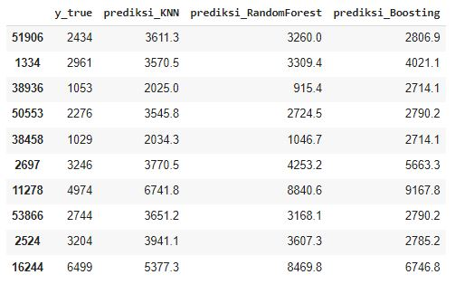

# Prediksi Harga Diamond
Ketika memiliki sebuah bisnis jual-beli diamonds (berlian) dengan model bisnis distributor dan retail, dimana perusahaan membeli diamond dari produsen kemudian menjualnya kepada konsumen, atau juga menerima penjualan kembali diamonds dari konsumen. Berbeda dengan emas yang harga jual dan belinya mengacu pada harga perdagangan emas dunia, harga diamond dipengaruhi oleh beberapa fitur khusus. Fitur tersebut antara lain, karat, ukuran, bentuk potongan, warna, serta tingkat kejernihan diamonds. Tidak adanya acuan harga diamond seperti acuan harga emas menyebabkan perusahaan memerlukan sistem untuk memprediksi harganya.

<b>Dataset yang digunakan :</b> https://raw.githubusercontent.com/tidyverse/ggplot2/master/data-raw/diamonds.csv

<b>Algoritma yang diterapkan</b>
* KNN
* Random Forest
* Ada Boost
  
<b>Contoh hasil Prediksi</b>

