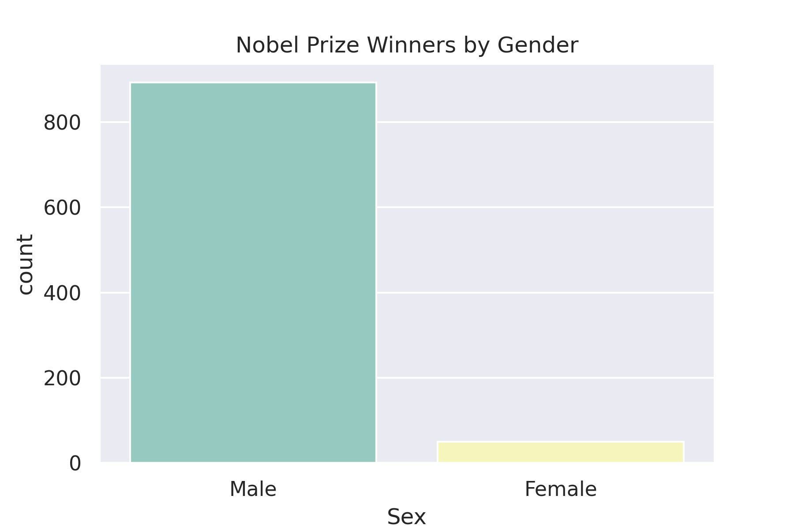

# Visualisasi Sejarah Penghargaan Nobel
Penghargaan Nobel mungkin merupakan penghargaan ilmiah paling bergengsi di dunia. Penghargaan tersebut setiap tahun diberikan kepada ilmuwan dan cendekiawan dalam kategori kimia, sastra, fisika, fisiologi atau kedokteran, ekonomi, dan perdamaian. Penghargaan Nobel pertama kali diberikan pada tahun 1901, dan pada saat itu Penghargaan itu masih sangat eurosentris dan berfokus pada laki-laki, tetapi untuk saat ini siapapun sudah dapat menerimanya, apakah itu benar?

<b>Dataset yang digunakan :<b> https://www.kaggle.com/nobelfoundation/nobel-laureates

## Perbandingan Penerima berdasarkan Jenis Kelamin

